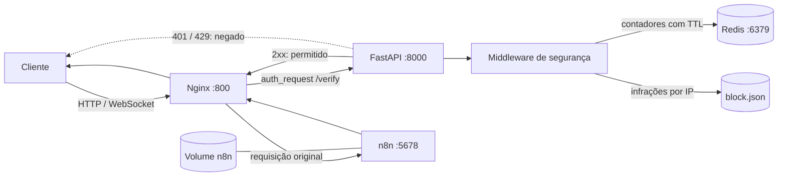

<div align="center">

# n8n Secure Gateway


**Gateway reverso para expor uma instância n8n através de uma camada central de controle, rate limiting e bloqueio por IP.**

<p>
  <a href="https://github.com/BrayanDevZN/N8n_server/actions/workflows/build.yml">
    
  </a>
</p>

<p>
  
  
  
  
  
  
</p>

</div>

## Visão geral

O **n8n Secure Gateway** coloca um proxy Nginx na frente do n8n. Antes de encaminhar uma requisição ao editor, webhook ou API do n8n, o Nginx faz uma sub-requisição para uma aplicação FastAPI. Essa API representa o ponto central para políticas de acesso.

O projeto foi estruturado para oferecer:

- uma única porta pública para o n8n;
- proxy reverso com suporte a HTTP e WebSocket;
- endpoint interno de autorização usando `auth_request` do Nginx;
- limite global de requisições;
- limite de requisições por endereço IP;
- contadores temporários com expiração no Redis;
- registro opcional de IPs reincidentes;
- persistência dos dados do n8n em volume Docker;
- execução reproduzível com Docker Compose;
- verificação automática de inicialização no GitHub Actions.


## Sumário

- [Tecnologias](#tecnologias)
- [Arquitetura](#arquitetura)
- [Como uma requisição é processada](#como-uma-requisição-é-processada)
- [Primeiros passos](#primeiros-passos)
- [Variáveis de ambiente](#variáveis-de-ambiente)
- [Modos de execução](#modos-de-execução)
- [Persistência dos dados](#persistência-dos-dados)
- [Comandos úteis](#comandos-úteis)
- [CI/CD](#cicd)
- [Solução de problemas](#solução-de-problemas)
- [Estrutura do projeto](#estrutura-do-projeto)
- [Estado atual e limitações](#estado-atual-e-limitações)

## Tecnologias

| Tecnologia | Função no projeto |
|---|---|
| **Nginx** | Porta de entrada, proxy reverso e autorização por sub-requisição. |
| **FastAPI** | API interna que executa as políticas de acesso. |
| **Redis** | Armazena os contadores temporários usados pelo rate limit. |
| **n8n** | Plataforma de automação protegida pelo gateway. |
| **Docker Compose** | Cria a rede e coordena os quatro serviços. |
| **GitHub Actions** | Inicializa o ambiente e executa o teste de prontidão. |

## Arquitetura



### Comunicação interna

Os serviços se encontram pelos nomes definidos no Compose. Esses endereços funcionam somente dentro da rede Docker:

| Origem | Destino | Endereço interno |
|---|---|---|
| Nginx | FastAPI | `http://api_n8n:8000/auth/` |
| Nginx | n8n | `http://n8n:5678` |
| FastAPI | Redis | `redis:6379` |

O usuário acessa apenas:

```text
http://localhost:800
```

## Como uma requisição é processada

1. O cliente envia uma requisição para o Nginx na porta `800`.
2. O Nginx cria uma sub-requisição interna para `/verify`.
3. A sub-requisição é encaminhada para `api_n8n:8000/auth/`.
4. Em modo `prod`, o middleware consulta bloqueios e limites.
5. O Redis mantém os contadores por uma janela de 60 segundos.
6. Uma resposta `2xx` autoriza o Nginx a encaminhar a requisição original ao n8n.
7. Uma resposta `401` ou `429` deve interromper o fluxo antes do n8n.

O corpo da requisição original não é enviado à API de autorização. Cookies e o cabeçalho `Authorization` são encaminhados para permitir a evolução futura da autenticação.

## Primeiros passos

### Pré-requisitos

- Git;
- Docker Engine ou Docker Desktop;
- plugin Docker Compose;
- porta `800` disponível.

Confirme a instalação:

```bash
docker --version
docker compose version
```

### 1. Clone o repositório

```bash
git clone https://github.com/BrayanDevZN/N8n_server.git
cd N8n_server
```

### 2. Crie o arquivo de ambiente

Crie `src/config/.env`:

```dotenv
# Origem aceita pela configuração de CORS
origin=http://localhost:800

# Número máximo de requisições por IP na janela de 60 segundos
rate_limit=60

# Número máximo de requisições globais na mesma janela
global_rate_limit=1000

# "dev" desativa as verificações; "prod" ativa o middleware
environment=dev

# Bloqueio persistente opcional
# block=true
# block_limit=3
```

> [!WARNING]
> Não versione o `.env`. O arquivo está no `.gitignore` porque pode conter valores específicos do ambiente.

### 3. Valide o Compose

```bash
docker compose -f compose.n8n.yml config
```

Esse comando detecta problemas de YAML, serviços inexistentes e volumes não declarados antes de criar containers.

### 4. Inicie os serviços

Usando as imagens publicadas:

```bash
docker compose -f compose.n8n.yml pull
docker compose -f compose.n8n.yml up -d
```

O primeiro `up` cria automaticamente o volume persistente declarado no arquivo. Nas execuções seguintes, o Compose conecta o mesmo volume ao n8n, preservando a conta, os workflows, as credenciais e as configurações da instância. Portanto, depois dessa inicialização, basta abrir o endereço do gateway e começar a usar.

Confirme o estado:

```bash
docker compose -f compose.n8n.yml ps
```

Os serviços `nginx`, `api_n8n`, `redis` e `n8n` devem aparecer como `Up`.

### 5. Acesse o n8n

Abra no navegador:

```text
http://localhost:800
```

O primeiro acesso solicita a criação da conta proprietária do n8n. Essa conta é armazenada no volume montado em `/home/node/.n8n`.

## Variáveis de ambiente

| Variável | Obrigatória | Exemplo | Descrição |
|---|:---:|---|---|
| `origin` | Sim | `http://localhost:800` | Origem aceita pela configuração de CORS. |
| `rate_limit` | Sim | `60` | Limite por IP durante a janela de 60 segundos. |
| `global_rate_limit` | Sim | `1000` | Limite compartilhado por todas as requisições. |
| `environment` | Sim | `dev` | Em `prod`, ativa as verificações do middleware. |
| `block` | Não | `true` | Habilita o registro de IPs reincidentes. |
| `block_limit` | Condicional | `3` | Quantidade de infrações permitida com bloqueio habilitado. |

As variáveis são carregadas por `src/config/settings.py`. Se uma variável obrigatória não existir, a API encerra a inicialização com `NotFoundEnv`.

## Modos de execução

O repositório possui dois arquivos Compose com finalidades diferentes.

### Imagens publicadas

Arquivo: `compose.n8n.yml`

```bash
docker compose -f compose.n8n.yml up -d
```

Esse modo baixa as imagens `brayandevzn/n8n_server` e é o caminho mais rápido para executar o conjunto. O volume nomeado do n8n está declarado nesse arquivo.

### Desenvolvimento local

Arquivo: `src/controller/compose.yml`

```bash
docker compose -f src/controller/compose.yml up --build -d
```

Esse modo constrói as imagens usando os Dockerfiles do repositório. Use-o quando alterar a API, o Nginx, as dependências ou a imagem do n8n.

| Arquivo | Origem das imagens | Uso recomendado |
|---|---|---|
| `compose.n8n.yml` | Docker registry | Execução rápida e validação das imagens publicadas. |
| `src/controller/compose.yml` | Código local | Desenvolvimento e testes de alterações locais. |

## Persistência dos dados

O Compose principal já está pronto para persistência. Não é necessário executar `docker volume create`, descobrir identificadores de volumes anônimos ou adicionar opções extras ao comando de inicialização. Esta configuração presente no repositório é suficiente:

```yaml
services:
  n8n:
    volumes:
      - n8n:/home/node/.n8n

volumes:
  n8n:
```

Ao executar `docker compose -f compose.n8n.yml up -d`, o Docker cria o volume caso ele ainda não exista ou reutiliza o volume já existente.

O diretório persistente do n8n é:

```text
/home/node/.n8n
```

Ele contém, entre outros dados:

- conta proprietária e usuários;
- workflows;
- credenciais criptografadas;
- configurações da instância;
- banco SQLite, quando essa é a configuração utilizada;
- chave de criptografia gerada pelo n8n.

`n8n` é o nome lógico do volume. O Docker Compose normalmente adiciona o nome do projeto como prefixo; por isso ele pode aparecer como `n8n_agent_n8n` em `docker volume ls`.

### Comportamento ao remover containers

| Comando | Container | Volume nomeado | Dados do n8n |
|---|:---:|:---:|:---:|
| `docker compose stop` | Mantido | Mantido | Mantidos |
| `docker compose down` | Removido | Mantido | Mantidos |
| `docker compose down -v` | Removido | **Removido** | **Apagados** |
| `docker compose up -d` | Criado/iniciado | Reutilizado | Mantidos |

> [!CAUTION]
> Não execute `docker compose down -v` se quiser preservar contas, workflows e credenciais.

### Verificar o volume

```bash
docker volume ls
docker compose -f compose.n8n.yml config --volumes
```

Um `VOLUME` declarado apenas no Dockerfile cria um volume anônimo. Para dados importantes, o volume nomeado no Compose é preferível porque pode ser identificado e reutilizado de maneira previsível.

## Comandos úteis

### Inicializar em segundo plano

```bash
docker compose -f compose.n8n.yml up -d
```

### Ver o estado dos containers

```bash
docker compose -f compose.n8n.yml ps
```

### Acompanhar todos os logs

```bash
docker compose -f compose.n8n.yml logs -f
```

### Acompanhar apenas um serviço

```bash
docker compose -f compose.n8n.yml logs -f nginx
docker compose -f compose.n8n.yml logs -f api_n8n
docker compose -f compose.n8n.yml logs -f n8n
docker compose -f compose.n8n.yml logs -f redis
```

### Reiniciar um serviço

```bash
docker compose -f compose.n8n.yml restart nginx
```

### Parar sem remover containers

```bash
docker compose -f compose.n8n.yml stop
```

### Remover containers preservando dados

```bash
docker compose -f compose.n8n.yml down
```

### Remover containers órfãos

```bash
docker compose -f compose.n8n.yml up -d --remove-orphans
```

### Testar o gateway

```bash
curl --fail --show-error http://localhost:800/
```

### Verificar a configuração do Nginx

```bash
docker compose -f compose.n8n.yml exec nginx nginx -t
```

## CI/CD

O workflow `.github/workflows/build.yml` é executado em pushes e pull requests direcionados à branch `main`.

O pipeline atual:

1. baixa o código do repositório;
2. cria o arquivo de ambiente usado no teste;
3. inicia os serviços com Docker Compose;
4. executa até 12 verificações HTTP dentro do container Nginx;
5. encerra com sucesso assim que o gateway responde;
6. mostra `docker compose ps` e os logs caso o ambiente não fique pronto.

O endereço `127.0.0.1:800` é usado no teste interno para evitar diferenças de resolução IPv4/IPv6 do `localhost` dentro do Alpine.

> [!NOTE]
> Apesar do badge CI/CD, o workflow atual realiza integração contínua e teste de prontidão. Ainda não existe uma etapa automática de publicação ou implantação.

## Solução de problemas

### `service "n8n" refers to undefined volume`

O serviço usa um volume que não foi declarado globalmente. O nome dos dois lados deve ser idêntico:

```yaml
services:
  n8n:
    volumes:
      - n8n:/home/node/.n8n

volumes:
  n8n:
```

### `host not found in upstream "api_n8n"`

O nome usado em `proxy_pass` precisa ser igual ao nome do serviço no Compose:

```yaml
services:
  api_n8n:
```

```nginx
proxy_pass http://api_n8n:8000/auth/;
```

### `Connection refused` no teste do workflow

Confira se o Nginx está ativo e escutando na porta correta:

```bash
docker compose -f compose.n8n.yml ps
docker compose -f compose.n8n.yml logs nginx
```

Dentro do container, prefira `127.0.0.1`:

```bash
docker compose -f compose.n8n.yml exec nginx \
  wget -q -O /dev/null http://127.0.0.1:800/
```

### Conta ou workflows desapareceram depois do `down`

Isso normalmente acontece quando o container utilizava um volume anônimo. O volume antigo pode continuar no Docker, mas o novo container recebe outro volume vazio.

Confira os volumes existentes:

```bash
docker volume ls
docker inspect <nome-do-container>
```

Use o volume nomeado declarado no Compose para evitar que o vínculo seja perdido novamente.

### Aviso de container órfão

O aviso aparece quando um serviço foi renomeado e o container antigo permaneceu no projeto:

```bash
docker compose -f compose.n8n.yml up -d --remove-orphans
```

### O n8n informa que Python não está instalado

Esse aviso vem do task runner interno do n8n. Ele não impede workflows JavaScript nem a inicialização do editor. Workflows que dependem do runner Python exigem uma configuração específica de task runners.

## Estrutura do projeto

```text
.
├── .github/
│   └── workflows/
│       └── build.yml              # Pipeline de integração contínua
├── compose.n8n.yml                # Execução com imagens publicadas
├── docs/
│   └── assets/                    # GIF e imagem da documentação
├── README.md
└── src/
    ├── app/
    │   ├── main.py                # Inicialização da aplicação FastAPI
    │   ├── midlleware.py          # Rate limit e bloqueio por IP
    │   └── router.py              # Endpoint interno /auth/
    ├── config/
    │   ├── .env                   # Configuração local não versionada
    │   └── settings.py            # Leitura e validação do ambiente
    ├── controller/
    │   ├── compose.yml            # Build e execução do código local
    │   ├── dockerfile.api         # Imagem da API FastAPI
    │   ├── dockerfile.n8n         # Imagem baseada no n8n
    │   ├── dockerfile.proxy       # Imagem do Nginx
    │   ├── proxy.conf             # Proxy reverso e auth_request
    │   └── requirements.txt       # Dependências Python
    ├── logs/
    │   ├── log.py                 # Configuração do logging
    │   └── app.log                # Arquivo gerado em execução
    ├── redis/
    │   ├── connection.py          # Conexão com o Redis
    │   └── control.py             # Leitura e incremento de contadores
    └── storage/
        ├── block.json             # Registro local de reincidências
        └── file.py                # Leitura e gravação do arquivo
```

## Estado atual e limitações

Antes de utilizar o gateway em produção, recomenda-se:

- converter limites do ambiente e valores do Redis para números;
- converter as flags de ambiente para booleanos reais;
- corrigir e testar a leitura e escrita do `block.json`;
- garantir que a API considere o IP real encaminhado pelo proxy;
- retornar respostas HTTP adequadas diretamente pelo middleware;
- adicionar health checks declarativos aos serviços do Compose;
- adicionar autenticação real ao endpoint interno de autorização;
- persistir o Redis caso os contadores precisem sobreviver a reinicializações;
- alinhar as variáveis criadas pelo workflow com as esperadas pela API;
- adicionar testes automatizados para limites, bloqueios e concorrência;
- configurar uma chave de criptografia fixa e segura para o n8n;
- revisar autenticação, TLS e exposição de portas antes de publicar na internet.

## Segurança

- Não exponha Redis ou FastAPI diretamente na internet.
- Não versione `.env`, credenciais ou chaves do n8n.
- Utilize HTTPS em ambientes públicos.
- Defina uma chave de criptografia permanente para evitar perda de acesso às credenciais.
- Faça backup periódico do volume do n8n.
- Restrinja permissões do Docker e do host.
- Revise os logs antes de armazená-los ou enviá-los a serviços externos.

---

<div align="center">
  Desenvolvido para tornar a exposição do n8n mais controlada, observável e segura.
</div>
