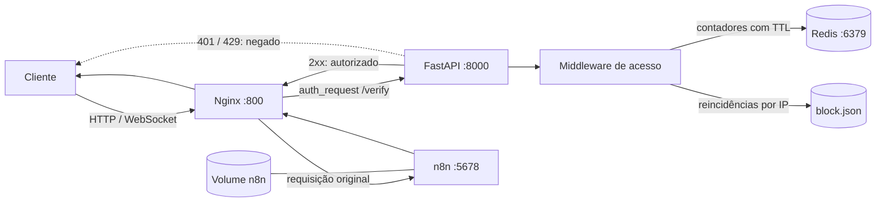

<div align="center">

# n8n Secure Gateway


**Gateway reverso para executar uma instância n8n com controle de acesso, rate limiting e bloqueio por IP.**

<p>
  <a href="https://github.com/BrayanDevZN/N8n_server/actions/workflows/build.yml">
    
  </a>
</p>

<p>
  
  
  
  
  
  
</p>

</div>

## Sobre o projeto

O **n8n Secure Gateway** adiciona uma camada intermediária entre o usuário e o n8n. Toda requisição pública chega primeiro ao Nginx, passa pela API FastAPI para verificação e, quando autorizada, é encaminhada ao n8n.

O projeto utiliza:

- **Nginx** como proxy reverso e porta de entrada;
- **FastAPI** para aplicar as regras de acesso;
- **Redis** para armazenar os contadores do rate limit;
- **n8n** como plataforma de automação;
- **Docker Compose** para executar e conectar os serviços.

O `compose.n8n.yml` já vem configurado com um volume nomeado para o n8n. Depois de criar o `.env`, basta iniciar os serviços e acessar o gateway. O volume é criado automaticamente no primeiro uso e reutilizado nas próximas inicializações.

## Arquitetura



### Fluxo de uma requisição

1. O cliente acessa o Nginx pela porta `800`.
2. O Nginx envia uma verificação interna para `/verify`.
3. A verificação chega à API em `api_n8n:8000/auth/`.
4. A API aplica as regras do middleware e consulta o Redis quando necessário.
5. Uma resposta de sucesso libera a requisição original para o n8n.
6. O n8n responde através do próprio Nginx.

### Serviços

| Serviço | Responsabilidade | Porta interna | Exposição pública |
|---|---|---:|:---:|
| `nginx` | Proxy reverso e entrada do sistema | `800` | Sim |
| `api_n8n` | Verificação e políticas de acesso | `8000` | Não |
| `redis` | Contadores temporários | `6379` | Não |
| `n8n` | Editor e automações | `5678` | Não |

### Endereços internos

Os containers se comunicam utilizando o nome de cada serviço:

```text
Nginx → FastAPI: http://api_n8n:8000/auth/
Nginx → n8n:     http://n8n:5678
FastAPI → Redis: redis:6379
```

O endereço utilizado pelo usuário é:

```text
http://localhost:800
```

## Como usar

### Pré-requisitos

- Git;
- Docker Engine ou Docker Desktop;
- Docker Compose;
- porta `800` disponível.

### 1. Clone o repositório

```bash
git clone https://github.com/BrayanDevZN/N8n_server.git
cd N8n_server
```

### 2. Configure o ambiente

Crie o arquivo `src/config/.env`:

```dotenv
# Origem autorizada pelo CORS
origin=http://localhost:800

# Limite de requisições por IP em 60 segundos
rate_limit=60

# Limite global de requisições em 60 segundos
global_rate_limit=1000

# Ambiente da aplicação
environment=dev

# Bloqueio opcional
# block=true
# block_limit=3
```

### 3. Inicie os serviços

Para usar as imagens publicadas:

```bash
docker compose -f compose.n8n.yml up -d
```

O Compose criará automaticamente:

- a rede interna dos serviços;
- os quatro containers;
- o volume nomeado do n8n.

### 4. Verifique os containers

```bash
docker compose -f compose.n8n.yml ps
```

Os serviços `nginx`, `api_n8n`, `redis` e `n8n` devem aparecer em execução.

### 5. Acesse o n8n

```text
http://localhost:800
```

No primeiro acesso, crie a conta proprietária da instância. A conta, os workflows, as credenciais e as configurações serão armazenados no volume do n8n.

## Volume do n8n

O Compose principal já contém esta configuração:

```yaml
services:
  n8n:
    volumes:
      - n8n:/home/node/.n8n

volumes:
  n8n:
```

Não é necessário criar o volume manualmente. O primeiro `up` cria o volume e os próximos reutilizam o mesmo armazenamento.

O volume preserva:

- conta e usuários;
- workflows;
- credenciais;
- configurações da instância;
- banco de dados local do n8n.

Para parar e remover os containers mantendo os dados:

```bash
docker compose -f compose.n8n.yml down
```

Para iniciar novamente usando os mesmos dados:

```bash
docker compose -f compose.n8n.yml up -d
```

> Não utilize `docker compose down -v` se quiser manter os dados, pois `-v` também remove o volume.

## Desenvolvimento local

Para construir as imagens usando o código e os Dockerfiles do repositório:

```bash
docker compose -f src/controller/compose.yml up --build -d
```

Use esse modo quando alterar a API, o proxy, as dependências Python ou a imagem do n8n.

## Comandos básicos

```bash
# Exibir os containers
docker compose -f compose.n8n.yml ps

# Acompanhar os logs
docker compose -f compose.n8n.yml logs -f

# Parar os serviços
docker compose -f compose.n8n.yml stop

# Reiniciar os serviços
docker compose -f compose.n8n.yml restart

# Remover os containers preservando o volume
docker compose -f compose.n8n.yml down
```

---

<div align="center">
  Desenvolvido para tornar a exposição do n8n mais controlada, organizada e segura.
</div>
