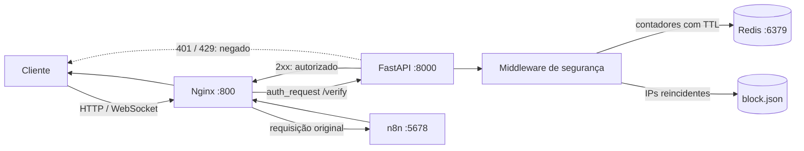

<div align="center">

# n8n Secure Gateway


**Gateway reverso para proteger uma instância n8n com autorização, rate limiting e bloqueio por IP.**

<p>
  <a href="https://github.com/BrayanDevZN/N8n_server/actions/workflows/build.yml">
    
  </a>
</p>

<p>
  
  
  
  
  
  
</p>

</div>

## Sobre o projeto

O **n8n Secure Gateway** adiciona uma camada de proteção na frente do n8n. Toda requisição pública chega primeiro ao Nginx, que consulta uma API FastAPI antes de liberar o acesso ao serviço de automação.

O projeto reúne:

- proxy reverso e suporte a WebSocket com Nginx;
- autorização centralizada por meio do `auth_request`;
- limite global e limite por endereço IP;
- contadores temporários armazenados no Redis;
- bloqueio opcional de IPs reincidentes;
- execução isolada com Docker Compose.

> [!IMPORTANT]
> Este repositório está em desenvolvimento. A estrutura principal está pronta, mas a seção [Estado atual](#estado-atual) lista os ajustes recomendados antes de uso em produção.

## Sumário

- [Como usar](#como-usar)
- [Variáveis de ambiente](#variáveis-de-ambiente)
- [Arquitetura](#arquitetura)
- [Estrutura do projeto](#estrutura-do-projeto)
- [Estado atual](#estado-atual)

## Como usar

### Pré-requisitos

- Git;
- Docker com o plugin Docker Compose;
- porta `800` disponível na máquina.

### 1. Clone o repositório

```bash
git clone https://github.com/BrayanDevZN/N8n_server.git
cd N8n_server
```

### 2. Configure o ambiente

Crie o arquivo `src/config/.env` com base no exemplo abaixo:

```dotenv
# Origem autorizada pelo CORS
origin=http://localhost:800

# Máximo de requisições por IP em uma janela de 60 segundos
rate_limit=60

# Máximo global de requisições em uma janela de 60 segundos
global_rate_limit=1000

# Use "dev" durante o desenvolvimento e "prod" para ativar o middleware
environment=dev

# Bloqueio persistente opcional
# block=true
# block_limit=3
```

O arquivo `.env` é ignorado pelo Git e não deve conter credenciais versionadas.

### 3. Inicie os serviços

Para construir as imagens locais e iniciar o ambiente completo:

```bash
docker compose -f src/controller/compose.yml up --build -d
```

O Compose inicia quatro serviços:

| Serviço | Responsabilidade | Porta interna |
|---|---|---:|
| `nginx` | Entrada pública e proxy reverso | `800` |
| `api_n8n` | Verificação e políticas de acesso | `8000` |
| `redis` | Contadores do rate limit | `6379` |
| `n8n` | Plataforma de automação | `5678` |

Depois da inicialização, acesse:

```text
http://localhost:800
```

Ou valide pelo terminal:

```bash
curl -I http://localhost:800
```

### 4. Acompanhe ou encerre o ambiente

```bash
docker compose -f src/controller/compose.yml logs -f
```

```bash
docker compose -f src/controller/compose.yml down
```

O arquivo `compose.n8n.yml` da raiz utiliza imagens previamente publicadas e é destinado a cenários de implantação, enquanto `src/controller/compose.yml` constrói as imagens a partir do código local.

## Variáveis de ambiente

| Variável | Obrigatória | Exemplo | Descrição |
|---|:---:|---|---|
| `origin` | Sim | `http://localhost:800` | Origem aceita pela configuração de CORS. |
| `rate_limit` | Sim | `60` | Limite por IP durante a janela de 60 segundos. |
| `global_rate_limit` | Sim | `1000` | Limite compartilhado entre todas as requisições. |
| `environment` | Sim | `dev` | Em `prod`, ativa as verificações do middleware. |
| `block` | Não | `true` | Habilita o registro e bloqueio de IPs reincidentes. |
| `block_limit` | Condicional | `3` | Número de infrações permitido quando `block` está habilitado. |

## Arquitetura



### Fluxo de uma requisição

1. O cliente envia uma requisição para o Nginx na porta `800`.
2. O Nginx faz uma sub-requisição interna para `api_n8n:8000/auth/`.
3. Em produção, o middleware consulta bloqueios e limites no Redis.
4. Uma resposta `2xx` libera a requisição original para o n8n.
5. Uma resposta `401` ou `429` interrompe o fluxo antes que ele alcance o n8n.

## Estrutura do projeto

```text
.
├── .github/workflows/build.yml    # Pipeline de integração contínua
├── compose.n8n.yml                # Compose baseado em imagens publicadas
├── docs/assets/                   # Imagens utilizadas na documentação
└── src/
    ├── app/
    │   ├── main.py                # Inicialização da aplicação FastAPI
    │   ├── midlleware.py          # Rate limit e bloqueio por IP
    │   └── router.py              # Endpoint interno de autorização
    ├── config/
    │   └── settings.py            # Carregamento das variáveis de ambiente
    ├── controller/
    │   ├── compose.yml            # Ambiente de desenvolvimento local
    │   ├── dockerfile.api         # Imagem da API
    │   ├── dockerfile.n8n         # Imagem do n8n
    │   ├── dockerfile.proxy       # Imagem do Nginx
    │   └── proxy.conf             # Regras do proxy e auth_request
    ├── logs/                      # Configuração e saída dos logs
    ├── redis/                     # Conexão e operações no Redis
    └── storage/                   # Persistência local de bloqueios
```

## Estado atual

Antes de uma implantação em produção, recomenda-se concluir estes pontos:

- converter explicitamente os limites para números e as flags para booleanos;
- validar a persistência e a concorrência do arquivo `block.json`;
- adicionar health checks e espera ativa pela disponibilidade do Redis;
- publicar a porta do proxy no Compose de implantação;
- ampliar a cobertura de testes do middleware e do fluxo de autorização.

---

<div align="center">
  Desenvolvido para tornar a exposição do n8n mais controlada, observável e segura.
</div>
